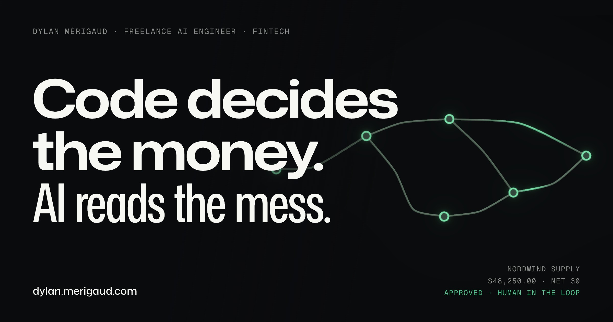

# merigaud.com

The portfolio of **Dylan Mérigaud**, freelance AI full-stack engineer for fintech (AP automation, approval workflows, agents, evals).

**Live: [merigaud.com](https://merigaud.com)**



## The idea

A portfolio for an engineer who builds AI into money systems should behave like one. So the site renders the thing it talks about: an **execution trace**.

The hero runs a live pass. A messy vendor invoice lands, an AI visibly reads it (OCR boxes, extracted values flying to a receipt), the amount routes through a 3D approval graph, `APPROVED` stamps in, and only then does the headline settle. As you scroll, a single green wire is drawn down the page through a dark channel cut into the paper, lighting a node at each section, the same trace, now the spine of the document. It ends on an `APPROVED` wax stamp. The medium is the message: deterministic where it must be, a bit of theatre where it earns attention.

## How it is built

- **Next.js 16** (App Router, React 19) · **Tailwind v4** · **TypeScript strict** (via [`@dylanmerigaud/config`](https://www.npmjs.com/package/@dylanmerigaud/config)).
- **The hero graph and seal are hand-written WebGL**, not an imported model. One parameterized GLSL `ShaderMaterial` drives the wires, the nodes, and the stamp; the wires are procedural `TubeGeometry` through hand-routed control points, not an image-to-3D asset. See [`components/ink-scene.tsx`](./components/ink-scene.tsx).
- **A degrade ladder, not a single experience.** SSR ships a real, media-free dark hero (headline + CTAs for SEO and no-JS). The client then picks: desktop + WebGL2 + motion allowed gets the ink3d run; everyone else gets a video hero; `prefers-reduced-motion` gets a static frame. The decision lives once in [`lib/hero-mode.ts`](./lib/hero-mode.ts) and is shared with a pre-paint guard so the headline never flashes on load.
- **Text is DOM, media is decoration.** The real copy is a normal DOM layer over an `aria-hidden` canvas; the WebGL and video never carry meaning. One shared rAF loop drives the scroll effects ([`components/trace-effects.tsx`](./components/trace-effects.tsx)); the scroll spine is pure CSS so it stays crisp and cheap.
- **Copy as data.** All text and structured data live in [`lib/copy.ts`](./lib/copy.ts) and [`lib/work-pages.ts`](./lib/work-pages.ts); components render, they do not author.
- `pnpm validate` (lint + prettier + typecheck + knip) is green, with zero dead code.

More on the design decisions (why procedural wires over image-to-3D, the four hero concepts considered) in [`docs/PLAN-V2.md`](./docs/PLAN-V2.md).

## Built with AI, on purpose

This repo is co-authored with Claude and every commit says so in its trailer. That is the point, not a confession: I build AI into products for a living, and the discipline around the AI is the work, strict types, an all-checks-green gate, a human reviewing every diff. The output is the argument.

## Run it

Requires **Node ≥ 22** and **pnpm 10** (via [corepack](https://nodejs.org/api/corepack.html); the repo pins `pnpm@10.24.0`).

```bash
corepack enable
pnpm install
pnpm dev        # http://localhost:3000
```

```bash
pnpm build      # production build
pnpm validate   # lint + format:check + typecheck + knip
```

The optional `pnpm hero:generate` script regenerates the hero media through [fal.ai](https://fal.ai) and needs a `FAL_KEY` in the environment. It is not needed to run the site.

## License

The **code** is [MIT](./LICENSE), take the shader, the degrade ladder, whatever is useful.

The **content is not**: the copy, the case studies, the testimonials, the avatars, the generated hero media, and the "Dylan Mérigaud" brand are all rights reserved. Reuse the engineering, not the identity.
